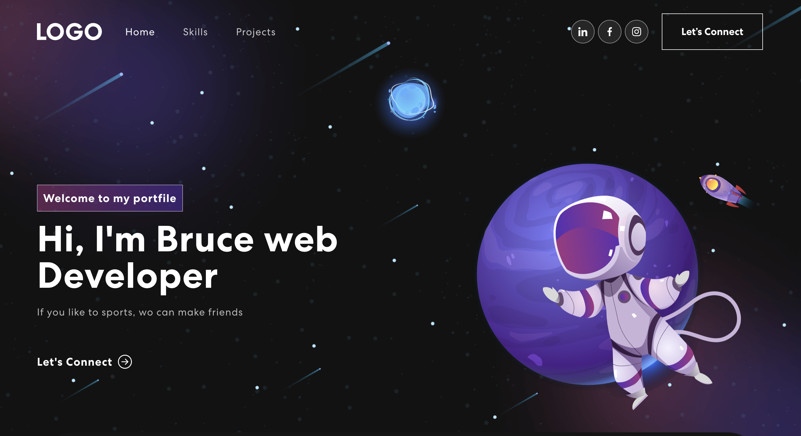

<!--
 * @Date: 2022-09-16 10:29:08
 * @Author: Bruce
 * @Description: 
-->
# [React](https://reactjs.org/) &middot; 

React is a JavaScript library for building user interfaces.

* **Declarative:** React makes it painless to create interactive UIs. Design simple views for each state in your application, and React will efficiently update and render just the right components when your data changes. Declarative views make your code more predictable, simpler to understand, and easier to debug.
* **Component-Based:** Build encapsulated components that manage their own state, then compose them to make complex UIs. Since component logic is written in JavaScript instead of templates, you can easily pass rich data through your app and keep the state out of the DOM.
* **Learn Once, Write Anywhere:** We don't make assumptions about the rest of your technology stack, so you can develop new features in React without rewriting existing code. React can also render on the server using Node and power mobile apps using [React Native](https://reactnative.dev/).

Built using:

- Front-end library: React
- CSS framework: React-bootstrap

### `npm install`

Install the required front-end environment

### `yarn start`

Runs the app in the development mode.\
Open [http://localhost:3000](http://localhost:3000) to view it in your browser.